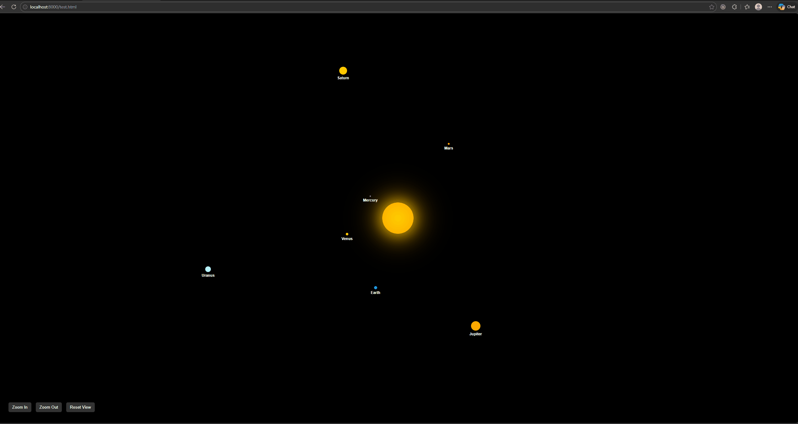
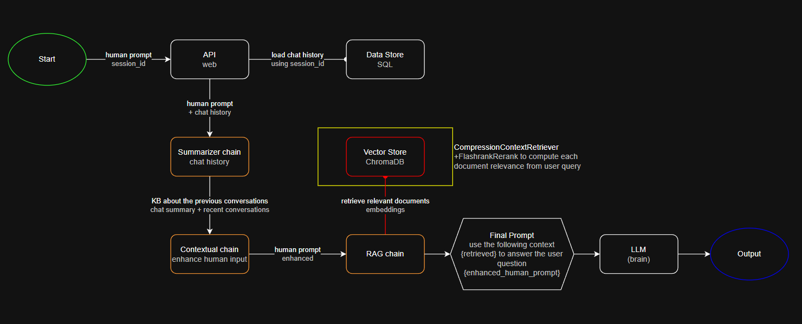

## Practice Project

I created this project to explore the opportunities in Prompt-Engineering.

This project use the following:

- Langchain - for the orchestration
- Ollama - to run the LLM model
- qwen3:4b-instruct - LLM Chat model
- FastAPI - to serve endpoints to interact with the LLM
- ChromaDB - for vector storage
- Sqlite3 - for data storage

Machine specs:

- i9-111900H @ 2.5Ghz (16 CPUs)
- 6GB VRAM (GeForce RTX 3060 Laptop GPU)
- 32GB RAM

### Sample Output 

**Generation Time:** ~1m,35s  
**LLModel:** qwen3:4b-instruct  
**Original Input:** "create a solar system app using only HTML, CSS and Javascript. The Sun must be at the center of the solar system. The planets must be orbiting the sun animated. The user must be able to navigate by pan, zoom in / out"  
**Enhanced Input:** "Create a solar system application using only HTML, CSS, and JavaScript, with the Sun at the center and planets orbiting it in smooth animations. Implement user navigation features including pan and zoom in/out."  
**Output:** [solarsystem.html](./docs/solarsystem.html)  
**Logs:**
```
2026-03-15 11:40:37 - INFO - api.chat - TODO: fetch the chat history to enhance the prompt and document retrieval
2026-03-15 11:40:37 - INFO - infra.data_store - check_session_id 3fa85f64-5717-4562-b3fc-2c963f66afa6
2026-03-15 11:40:37 - INFO - api.chat - resolved session_id: 775e42cc-2b25-46eb-a548-49d57eb1a252
2026-03-15 11:40:37 - INFO - utils.llm - model: qwen3:4b-instruct
2026-03-15 11:40:37 - INFO - chains.rag_chain - langchain: 1.2.10
2026-03-15 11:40:37 - INFO - chains.rag_chain - include chat history as reference..
2026-03-15 11:40:37 - INFO - chains.contextual_chain - enhancing the context of user input based on chat history.
2026-03-15 11:40:37 - INFO - utils.chat - history_as_turns..
2026-03-15 11:40:37 - INFO - utils.chat - formatted_turns..
2026-03-15 11:40:37 - INFO - chains.contextual_chain - {'input': 'create a solar system app using only HTML, CSS and Javascrip...', 'summary': '[No previous chat summary]...'}
INFO:httpx:HTTP Request: POST http://host.docker.internal:11434/v1/chat/completions "HTTP/1.1 200 OK"
2026-03-15 11:40:39 - INFO - utils.llm - confidence: 92.78804060390493
2026-03-15 11:40:39 - INFO - chains.contextual_chain - Original input: create a solar system app using only HTML, CSS and Javascript. The Sun must be at the center of the solar system. The planets must be orbiting the sun animated. The user must be able to navigate by pan, zoom in / out
2026-03-15 11:40:39 - INFO - chains.contextual_chain - Enhanced input: Create a solar system application using only HTML, CSS, and JavaScript, with the Sun at the center and planets orbiting it in smooth animations. Implement user navigation features including pan and zoom in/out.
2026-03-15 11:40:39 - INFO - chains.rag_chain - retrieving documents
2026-03-15 11:40:39 - INFO - infra.vector_store - retrieve_relevant_documents: 775e42cc-2b25-46eb-a548-49d57eb1a252
INFO:httpx:HTTP Request: POST http://host.docker.internal:11434/api/embed "HTTP/1.1 200 OK"
INFO:httpx:HTTP Request: POST http://host.docker.internal:11434/v1/chat/completions "HTTP/1.1 200 OK"
2026-03-15 11:42:12 - INFO - utils.llm - confidence: 91.2243286138521
2026-03-15 11:42:12 - INFO - chains.rag_chain - Result:
```




**Generation Time:** ~1m,18s  
**LLModel:** qwen3:4b-instruct  
**Original Input:** "create a solar system explorer using HTML, CSS and Javascript, use javascript libraries for the 3d animation"  
**Enhanced Input:** "Create a solar system explorer using HTML, CSS, and JavaScript, with 3D animation achieved through JavaScript libraries."  
**Output:** [solarsystem2.html](./docs/solarsystem2.html)  
**Logs:**
```
2026-03-15 13:56:22 - INFO - api.chat - TODO: fetch the chat history to enhance the prompt and document retrieval
2026-03-15 13:56:22 - INFO - infra.data_store - check_session_id 3fa85f64-5717-4562-b3fc-2c963f66afa6
2026-03-15 13:56:22 - INFO - api.chat - resolved session_id: ca0fe794-fbe0-412b-bcd4-8a0e7b5b578b
2026-03-15 13:56:22 - INFO - utils.llm - model: qwen3:4b-instruct
2026-03-15 13:56:22 - INFO - chains.rag_chain - langchain: 1.2.10
2026-03-15 13:56:22 - INFO - chains.rag_chain - include chat history as reference..
2026-03-15 13:56:22 - INFO - chains.contextual_chain - enhancing the context of user input based on chat history.
2026-03-15 13:56:22 - INFO - utils.chat - history_as_turns..
2026-03-15 13:56:22 - INFO - utils.chat - formatted_turns..
2026-03-15 13:56:22 - INFO - chains.contextual_chain - {'input': 'create a solar system explorer using HTML, CSS and Javascrip...', 'summary': '[No previous chat summary]...'}
INFO:httpx:HTTP Request: POST http://host.docker.internal:11434/v1/chat/completions "HTTP/1.1 200 OK"
2026-03-15 13:56:26 - INFO - utils.llm - confidence: 94.84467659256201
2026-03-15 13:56:26 - INFO - chains.contextual_chain - Original input: create a solar system explorer using HTML, CSS and Javascript, use javascript libraries for the 3d animation
2026-03-15 13:56:26 - INFO - chains.contextual_chain - Enhanced input: Create a solar system explorer using HTML, CSS, and JavaScript, with 3D animation achieved through JavaScript libraries.
2026-03-15 13:56:26 - INFO - chains.rag_chain - retrieving documents
2026-03-15 13:56:26 - INFO - infra.vector_store - retrieve_relevant_documents: ca0fe794-fbe0-412b-bcd4-8a0e7b5b578b
INFO:httpx:HTTP Request: POST http://host.docker.internal:11434/api/embed "HTTP/1.1 200 OK"
INFO:httpx:HTTP Request: POST http://host.docker.internal:11434/v1/chat/completions "HTTP/1.1 200 OK"
2026-03-15 13:57:40 - INFO - utils.llm - confidence: 90.5071675339105
2026-03-15 13:57:40 - INFO - chains.rag_chain - Result:
```


### API Process Flow



